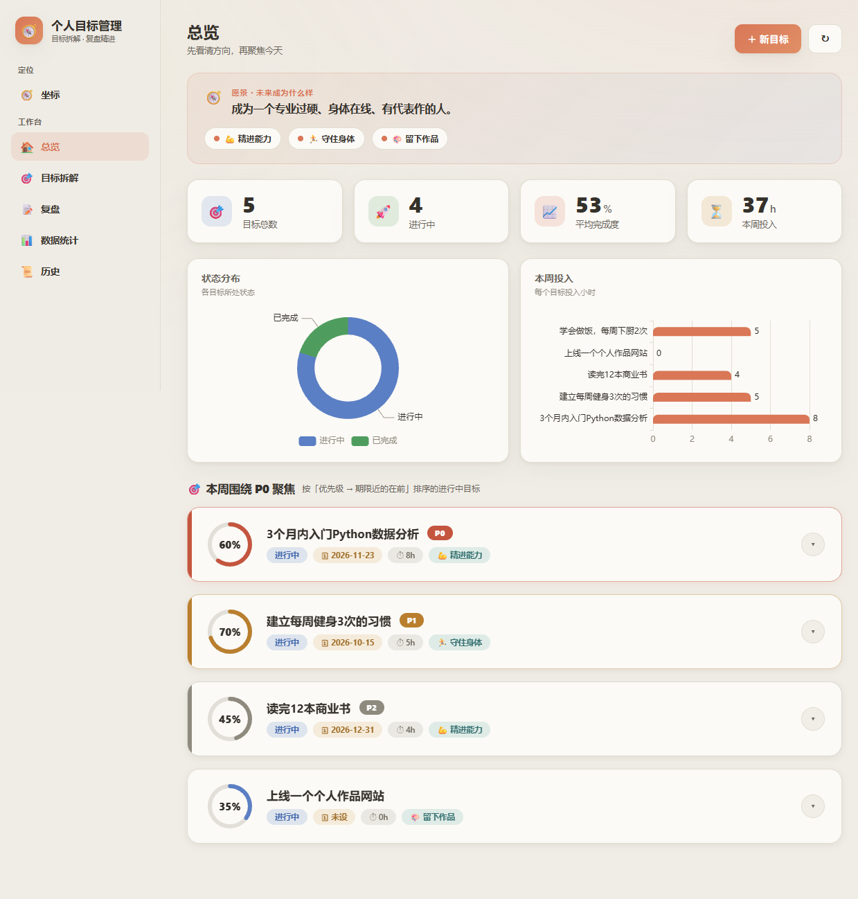
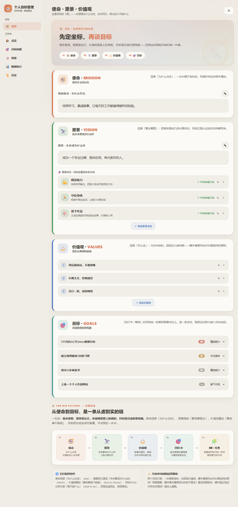
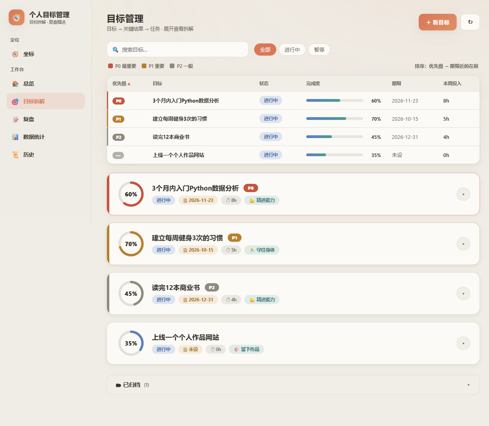
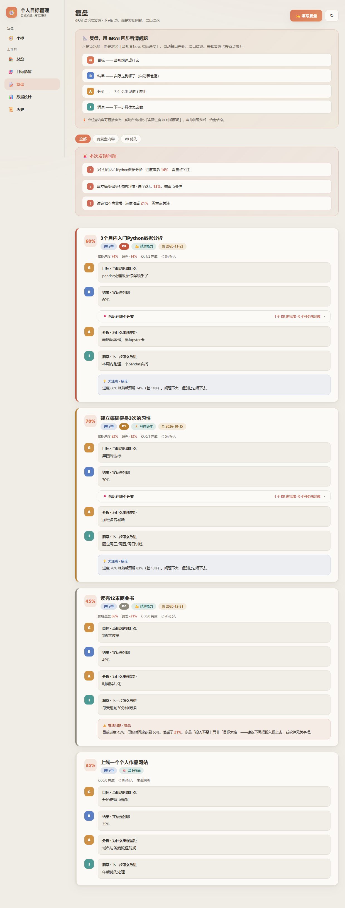
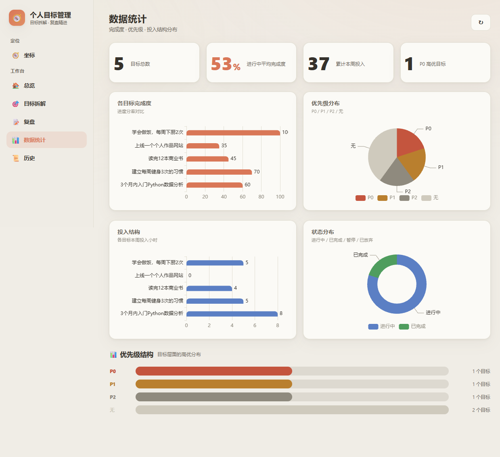
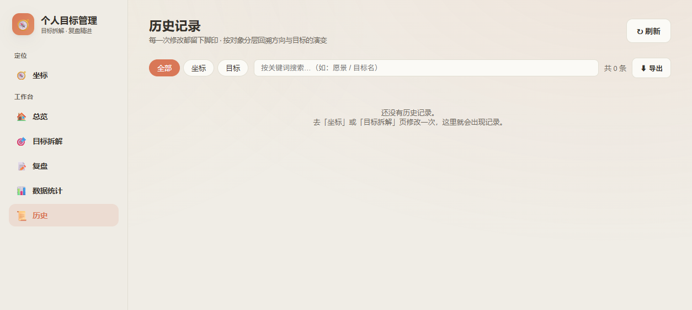

# 人生罗盘 · 个人目标管理工作台

> 使命 → 愿景 → 价值观 → 目标 → 关键结果 → 任务，环环相扣，帮你看清该往哪走、走得怎么样。

<p align="center">
  <a href="./LICENSE"></a>
  <a href="./package.json"></a>
  
  
  
  
  
  
  
  
</p>

<p align="center">
  <b>🔗 <a href="https://chanceeix.github.io/goal-coach-local/">在线预览（静态版）</a></b>
  &nbsp;·&nbsp;
  <a href="https://github.com/ChanceEix/goal-coach-local">GitHub 仓库</a>
  &nbsp;·&nbsp;
  <a href="./docs/README.md">完整文档</a>
</p>

> 预览站是**纯静态展示**（界面截图 + 功能介绍），不能真实操作数据。想真正用起来，请按下方「快速开始」在你自己电脑上运行。

## 核心主张 · 为什么可以放心用

> **你的数据，只属于你。**
>
> 所有信息都存放在**你自己的电脑**上，**不上传任何服务器**，无需账号登录；代码**完全开源、公开可查**——你可以自己审一遍它到底访问了哪些数据。"看得见"的透明度，比任何隐私承诺书都更让人安心。

## 这是什么

「人生罗盘」是一个 **本地优先（Local-first）** 的个人目标管理网站，把「人生坐标」和「OKR 执行」装进同一个界面：

- **人生坐标**（使命/愿景/价值观）—— 回答"我为什么存在、想成为什么样、怎么做"。
- **目标 OKR**（目标 O → 关键结果 KR → 任务）—— 把坐标拆成可执行、可量化的下一步。
- **每周复盘**（GRAI 结论式）—— 自动对比"实际进度 vs 时间预期"，发现落后、导出结论。

## 核心亮点

- 🧭 **三层承接、由虚到实**：使命 → 愿景支柱 → 目标 → KR → 任务，一眼看清每个目标挂在哪根"人生支柱"上。
- 🎯 **可视化管理**：环形进度、优先级色带（P0/P1/P2）、到期排序、归档区，界面用 Claude 暖米色系，克制耐看。
- 📈 **GRAI 复盘结论**：自动评估"目标 vs 实际"，生成结论式洞察（进步/落后/加速/风险），每周花几分钟就能完成复盘。
- 📜 **全量变更历史**：坐标与目标的所有修改都有差分记录，可回溯、可导出 CSV。
- 🖥️ **本地运行、离线可用**：图表库本地化，断网也能用；数据就是两个 JSON 文件，备份即复制。

## 技术栈

- **后端**：Node.js + Express（REST API，JSON 文件持久化）
- **前端**：原生 HTML / CSS / JavaScript（无框架，轻量）
- **图表**：ECharts（已本地化到 `public/vendor/`，离线可用）
- **样式**：自定义 Claude 暖米色设计系统

## 快速开始

### 环境要求

- Node.js **22.x**（务必用 22 或以上；低版本可能导致文件写入权限异常）

### 安装 & 启动

```bash
# 1. 安装依赖（首次需要，之后可跳过）
npm install

# 2. 启动服务
npm start
#    或 Windows 直接双击 start.bat（脚本会自动探测 WorkBuddy 管理的 Node 路径）

# 3. 打开浏览器访问
http://localhost:3211
```

> **首次运行会自动载入示例数据**：仓库自带的 `data/goals.example.json`（匿名示例）会在第一次启动时
> 自动复制成 `data/goals.json`，你打开就能看到一套完整的示例目标（使命 / 愿景 / 3 个支柱 / 若干目标），
> 不需要任何手动操作。想从零开始，直接在界面里把示例内容删掉即可。
> **`data/history.json` 同样由服务端自动创建，不用管。**

> 自定义端口：`PORT=8080 npm start`（通过环境变量传入，无需改任何配置文件）。

### 数据文件（可随时备份 / 迁移）

| 文件 | 内容 | 是否进仓库 |
|------|------|-----------|
| `data/goals.json` | 人生坐标（使命/愿景/价值观）+ 全部目标 O/KR/任务 | ❌ 已排除 |
| `data/history.json` | 所有修改的历史变更（差分格式） | ❌ 已排除 |
| `data/goals.example.json` | 匿名示例数据，供初次体验参考 | ✅ 会提交 |

> **隐私提醒**：前两个文件是纯 JSON，不做任何加密，但**默认已被 `.gitignore` 排除**，不会被提交。
> 备份就是直接复制这两个文件；换新电脑时把复制的 `data/` 覆盖过去即可。

## 页面一览

| 页面 | PAGE_KEY | 功能 |
|------|----------|------|
| 总览 `index.html` | `overview` | 愿景横幅 + KPI + 趋势图 + P0 聚焦卡片 |
| 坐标 `mission.html` | `mission` | 编辑使命/愿景/价值观 + 愿景支柱 + 目标挂靠关系 |
| 目标管理 `goals.html` | `goals` | O→KR→任务 树 + 速览表格 + 归档区 |
| 复盘 `review.html` | `review` | GRAI 结论式复盘（全部/有复盘内容/P0优先） |
| 数据统计 `stats.html` | `stats` | 目标分布、进度、优先级等统计图表 |
| 历史 `history.html` | `history` | 按对象分层回溯 + CSV 导出 |

## 页面截图

| 总览                                   | 坐标                                  |
| ------------------------------------ | ----------------------------------- |
|  |  |

| 目标管理 | 复盘 |
|------|------|
|  |  |

| 数据统计 | 历史 |
|------|------|
|  |  |

## 数据模型

- **层级** `level`：`目标O` / `关键结果KR` / `任务`
- **上级串联** `parentId`：目标O 为 `""`；KR 指目标O；任务 指 KR
- **状态** `status`：`进行中` / `已完成` / `暂停` / `已放弃`
- **优先级** `priority`：`P0` / `P1` / `P2` / `""`（无）
- **完成度** `progress`：0–100
- **期限** `deadline`：目标总期限 / 任务截止日
- **挂靠愿景支柱** `missionId`：一条目标 O 可归属某条愿景支柱

## API

| 方法 | 路径 | 说明 |
|------|------|------|
| GET | `/api/goals` | 读取全部目标（含坐标） |
| POST | `/api/goals` | 新增目标（O/KR/任务） |
| PUT | `/api/goals/:id` | 增量更新 |
| DELETE | `/api/goals/:id` | 删除（连带子孙） |
| GET | `/api/vvm` | 读取使命/愿景/价值观 |
| PUT | `/api/vvm` | 覆盖写入坐标 |
| GET | `/api/history` | 读取变更历史 |
| GET | `/api/health` | 健康检查 |

## 目录结构

```
├── server.js            # Express 后端（CRUD + 坐标读写 + 历史 + 静态托管）
├── package.json         # 依赖与启动脚本
├── data/                # 数据文件（goals.json / history.json，本地私有）
├── public/              # 前端静态资源（6 个页面 + 样式 + 本地图表库）
│   └── vendor/          # 本地 echarts.min.js（离线可用）
└── docs/                # 完整规范文档（产品/视觉/架构/数据/API 等 15 篇）
```

## 相关说明

- 本项目数据完全本地化，**不涉及任何账号、登录、云端同步**，开箱即用。
- 想在自己服务器/电脑上跑一个**私有实例**？完全支持——它就是开源自部署的，数据始终在你自己手里。
- 如需公开展示，请将 `data/goals.json` 替换为匿名示例数据后再提交（`.gitignore` 已默认忽略真实/私有数据）。

## 开源许可

MIT License —— 自由使用、修改、分发。详见 [LICENSE](LICENSE)。
